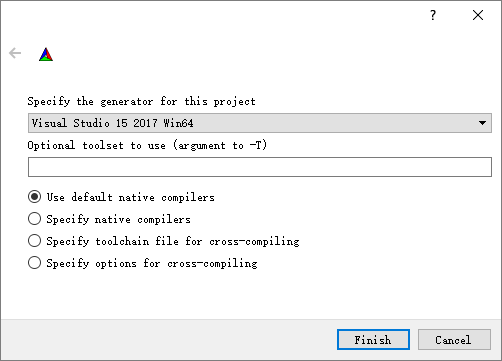

# 编程环境配置

**依赖项：** Kinect SDK提供了获取传感器数据和相机信息的API；需要用到Opencv的图像数据结构、显示、存储等；PCL中用到点云数据结构，点云存取等；
- Kinect SDK 2.0
- Opencv
- PCL

两种配置方法：
1. VS添加Kinect SDK属性表的方式（不推荐使用，对每个依赖库手动添加属性表比较繁琐）；
2. 使用Cmake  **推荐方式**

由于CMAKE配置方式配置过程简单，项目构建与调整更加灵活，只介绍CMake配置方法；

## 环境配置方法（使用CMAKE）

### visual studio
  1. visual studio版本需要等于或高于目标平台。即，你计划用vc14 x64的编译配置，那么vs版本不能低于2015版；
  2. opencv、pcl库的编译选项一定需要和目标编译选项一致。建议下载预编译版本的OPENCV与PCL，注意下载时，选择与目标平台相同的预编译版本；如`PCL-1.8.1-AllInOne-msvc2017-win64.exe`与`opencv-3.4.0-vc14_vc15.exe`均为`vc15 x64`的配置，在用CMAKE编译自己代码时，平台选择应相同。
  
### [cmake](https://cmake.org/)
  - 添加Kinect sdk2的cmake配置文件。将Samples目录下的`FindKInectSDK2.cmake`文件复制到Cmake安装目录下的`share\cmake-3.10\Modules\`文件夹中。例如：`D:\CMAKE\share\cmake-3.10\Modules`。

### [Opencv](https://opencv.org/releases.html)
  - 可自己编译或下载预编译版本
  - 注意平台一致性
  - Opencv环境变量
    1. 在系统变量中添加`OpenCV_DIR`，值为build目录下包含`OpenCVConfig.cmake`文件的文件夹路径。例如:`D:\opencv3.2\build_vc15_x64\install`;
    2. 在环境变量`Path`中添加opencv `bin`目录，例如：`D:\opencv3.2\build_vc15_x64\install\bin`
### [PCL](http://unanancyowen.com/en/)
  可自行编译或下载预编译版本。
